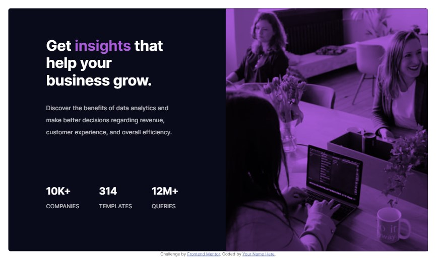

# Frontend Mentor - Stats preview card component solution

This is a solution to the [Stats preview card component challenge on Frontend Mentor](https://www.frontendmentor.io/challenges/stats-preview-card-component-8JqbgoU62). Frontend Mentor challenges help you improve your coding skills by building realistic projects.

## Table of contents

- [Overview](#overview)
  - [The challenge](#the-challenge)
  - [Screenshot](#screenshot)
  - [Links](#links)
- [My process](#my-process)
  - [Built with](#built-with)
  - [What I learned](#what-i-learned)
  - [Continued development](#continued-development)
- [Author](#author)

## Overview

### The challenge

Users should be able to:

- View the optimal layout depending on their device's screen size

### Screenshot

### Links

- Solution URL: [Checkout Github for source code](https://github.com/maciejka7/frontendmentors-card-stats)
- Live Site URL: [Live preview provided by Vercel](https://frontendmentors-card-stats.vercel.app/)

## My process

### Built with

- Semantic HTML5 markup
- SCSS with mixin and variables
- Flexbox
- CSS Grid
- Mobile-first workflow
- A little little bit of magci by [GSAP](https://greensock.com/gsap/)
- Build by [Parcel](https://parceljs.org/)

### What I learned

Basic usage of HTML and styling with SASS

I'm porud of SASS flie code spliting and organization and BEM usage.

### Continued development

In future I want to focus to add better animation on this project using GSAP

## Author

- Website - [Michał Maciejewski](https://github.com/maciejka7)
- Frontend Mentor - [@maciejka7](https://www.frontendmentor.io/profile/maciejka7)
- Twitter - [@maciejka77](https://twitter.com/maciejka77)
